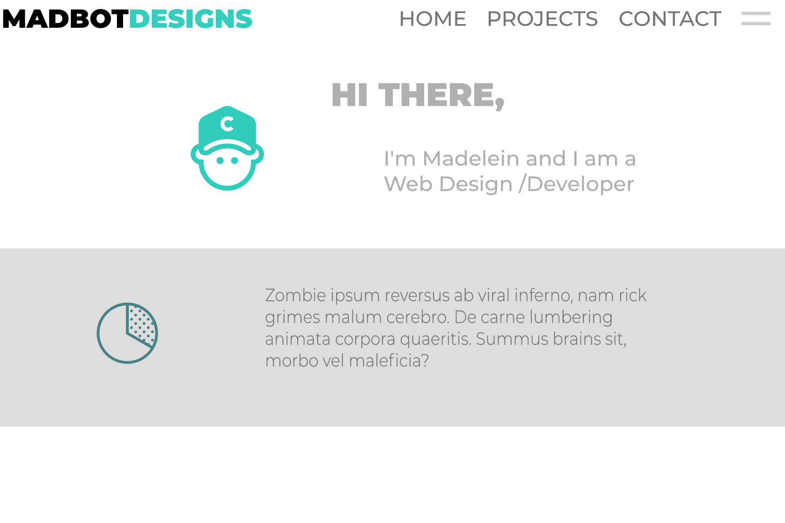
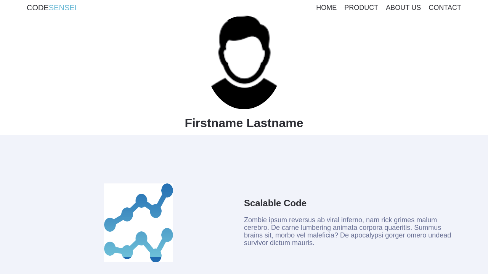

# Flexbox Landing Page

---

## Project Objective
Build an app that is both *functional* and *scallable* with any media device using Flexbox and Flexbox properties.

***

## Requirements
#### Requirement Number One:
- Start by building the ```navbar``` and make the **```drowpdown menu functional```** using flexbox properties. Design the navbar for ```mobile``` use. Create the landing page ```header``` and build the ```services-section```. After that create the first ```Media Object``` and make use of **```Flexbox ordering```**.

#### Requirement Number Two: 
- Next, add the ```Quote button``` and start designing the ```portfolio object```. Make sure that the portfolio object is **```mobile compatible```**. Remember to make the ```Media Objects``` mobile compatible.

#### Requirement Number Three: 
- Start creating the ```contact form``` and make the form mobile compatible.

***

## Project Thumbnails:



